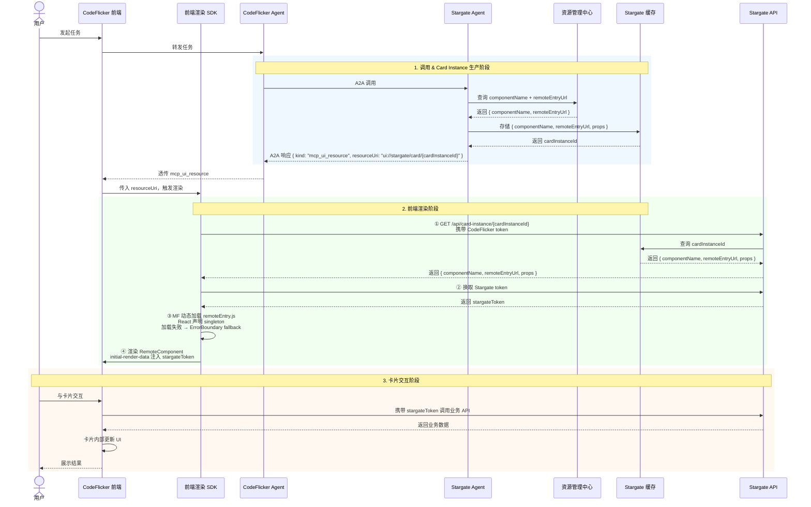
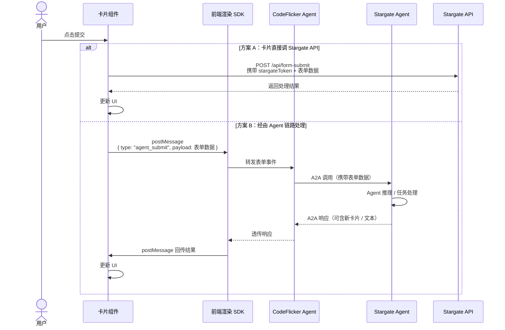

# A2A 协议渲染 Card 设计方案

## 一、背景与目标

在 A2A 协议体系下，实现 CodeFlicker 调用 Stargate Agent 并渲染其返回的业务自定义卡片的完整能力。

**产出物：**
- 一套数据结构：A2A 协议中关于渲染 Card 的协议扩展结构（P0）
- 一个 Card Instance 生产/消费方案（P0）
- 一个前端渲染 SDK，基于 mcp-ui 扩展实现（P0）
- 一个通用转化函数：client agent 识别并透传 mcp_ui_resource（P1）

---

## 二、各模块职责

| 模块 | 职责 |
|---|---|
| **Stargate 资源管理中心** | 存储卡片的 componentName + remoteEntryUrl 索引 |
| **Stargate Agent** | 组装 card instance，管理缓存，鉴权，换 token |
| **A2A 协议扩展** | parts 里携带 `mcp_ui_resource` + `resourceUri` |
| **CodeFlicker Agent** | 识别并透传 `mcp_ui_resource`，不做额外处理 |
| **前端渲染 SDK** | 串行完成：换 instance → 换 token → MF 加载 → 渲染 |
| **卡片组件库** | 独立构建，暴露 remoteEntry.js，自带交互逻辑 |

---

## 三、A2A 协议扩展结构

在 A2A message 的 `parts` 中新增 `kind: "mcp_ui_resource"` 类型的 part：

```json
{
  "message": {
    "role": "ROLE_AGENT",
    "parts": [
      {
        "data": {
          "kind": "mcp_ui_resource",
          "resourceUri": "ui://stargate/card/{cardInstanceId}",
          "uiMetadata": {
            "preferred-frame-size": { "width": 400, "height": 300 }
          }
        },
        "mediaType": "application/json"
      }
    ]
  }
}
```

与 mcp-ui 的 `ui://` URI 约定对齐，无需额外 extensions 字段。

---

## 四、整体链路时序图



---

## 五、卡片表单提交时序图

卡片是由开发者维护的黑盒，SDK 同时支持两种提交模式，卡片开发者按需选择。

区分方式：通过 `postMessage` 的 `type` 字段路由：
- 普通业务事件 → 卡片自行处理（方案 A）
- `type: "agent_submit"` → SDK 识别后走 Agent 链路（方案 B）



---

## 六、关键设计决策

### 为什么使用 cardInstanceId 而非直接传三元组？

props 中包含敏感业务数据，不能明文在 A2A 协议中传输。cardInstanceId 方案让敏感数据留在服务端，前端持 token 换取，服务端在此处做鉴权和数据脱敏。

### 为什么使用 Module Federation 而非 srcdoc？

Stargate 资源管理中心存储的是组件名称和组件库的 remoteEntryUrl，而非构建产物。MF 动态加载可以直接消费这个索引，无需 Stargate 做额外构建；同时卡片运行在主页面 React 环境里，交互能力无限制。

### Token 注入方式

SDK 串行执行：先用 CodeFlicker token 换取 Stargate token，再通过 `initial-render-data` 注入卡片，卡片交互时自带 stargateToken 调用业务 API。

---

## 七、HTML 片段渲染

### 背景

除 Card 之外，Agent 还可以直接在消息中返回一段 HTML 字符串用于轻量展示。与 Card 的核心区别在于：内容直接内联，无需走 cardInstanceId 换取流程。

### 协议扩展

复用 `kind: "mcp_ui_resource"` 结构，通过 `mimeType` 区分 Card 与 HTML 两种形态：

```json
{
  "kind": "mcp_ui_resource",
  "resourceUri": "ui://stargate/html/{instanceId}",
  "uiMetadata": {
    "mimeType": "text/html;profile=mcp-app",
    "preferred-frame-size": { "width": 400, "height": 300 },
    "inline": "<h2>查询结果</h2><p>共 42 条</p>"
  }
}
```

与 Card part 的唯一区别：`mimeType` 为 `text/html;profile=mcp-app`，内容通过 `inline` 字段直接携带，无需二次网络请求。

> `text/html;profile=mcp-app` 与 mcp-ui 协议标准对齐。

### 前端渲染链路

SDK 解析 `mcp_ui_resource` 时，通过 `mimeType` 路由到不同渲染链路：

```
解析 part.kind === "mcp_ui_resource"
        ↓
读取 uiMetadata.mimeType
        ├── application/json             → Card 渲染链路（现有流程）
        └── text/html;profile=mcp-app   → HTML 渲染链路（新增）
```

HTML 渲染链路：

```
读取 uiMetadata.inline（HTML 字符串）
        ↓
创建 <iframe sandbox="allow-scripts allow-same-origin" srcdoc="...">
        ↓
注入 HTML 内容
        ↓
根据 preferred-frame-size 设置尺寸（可选）
        ↓
渲染完成
```

使用 `iframe sandbox` 而非 `innerHTML` 的原因：与 mcp-ui 协议规范一致，HTML 来自 AI 生成内容，通过沙箱隔离防止潜在风险蔓延至主文档。

`sandbox` 属性配置：

| 属性 | 说明 |
|---|---|
| `allow-scripts` | 允许 iframe 内 JS 执行，支持交互型 HTML |
| `allow-same-origin` | 允许访问同源资源 |
| 不加 `allow-top-navigation` | 防止跳转攻击 |
| 不加 `allow-forms` | 防止表单提交劫持 |

### HTML 片段与 SDK 的通信

HTML 片段运行在 `iframe sandbox` 内，通过 `postMessage` 与 SDK 通信。

**职责划分：**

| 层 | 职责 |
|---|---|
| **iframe 内 HTML** | 监听用户交互，postMessage 上报意图 |
| **SDK** | 创建 iframe、监听消息、校验来源、驱动 A2A 对话 |
| **上层应用** | 只感知 A2A 对话流，不感知 iframe 细节 |

**消息协议：**

| 消息类型 | 触发时机 | SDK 响应 |
|---|---|---|
| `html_ready` | iframe 内容加载完成 | 移除 loading 态 |
| `html_resize` | 内容高度变化 | 动态调整 iframe 高度 |
| `html_action` | 用户交互（点击按钮等） | 触发 Agent 新一轮请求 |

SDK 监听时通过 `event.source` 校验，只处理来自自己创建的 iframe 的消息：

```
SDK 创建 iframe 时，同步注册监听：
window.addEventListener('message', (event) => {
    if (event.source !== iframeEl.contentWindow) return
    if (event.data.type !== 'html_action') return
    // 将 payload 转为新一轮 A2A 用户消息
})
```

### HTML 片段交互时序图

```mermaid
sequenceDiagram
    participant User as 用户
    participant iFrame as iframe (HTML 片段)
    participant SDK as SDK
    participant Agent as Agent

    Agent->>SDK: 返回 mcp_ui_resource (mimeType: text/html;profile=mcp-app)
    SDK->>iFrame: 创建 iframe，注入 srcdoc HTML 内容
    SDK->>SDK: 注册 message 监听，绑定 iframe 引用

    User->>iFrame: 点击按钮 / 表单交互
    iFrame->>iFrame: 监听 click 事件，构造 html_action payload
    iFrame->>SDK: window.parent.postMessage({ type: "html_action", payload })

    SDK->>SDK: event.source 校验（过滤无关消息）
    SDK->>SDK: 解析 payload，构造 A2A 用户消息

    SDK->>Agent: 发起新一轮 A2A 请求
    Agent->>SDK: 返回新 message parts
    SDK->>iFrame: 渲染新内容（HTML 或 Card）
```

### Card 与 HTML 片段对比

| | Card | HTML 片段 |
|---|---|---|
| 内容来源 | 网络请求换取 | 直接内联 |
| 渲染方式 | Module Federation 加载组件 | iframe srcdoc |
| 鉴权 | Stargate token | 无需 |
| 隔离 | 组件自带 | iframe sandbox |
| 适用场景 | 复杂交互、有业务数据 | 轻量展示、静态内容 |

---

## 八、待评审项

| # | 问题 | 说明 |
|---|---|---|
| 1 | cardInstanceId TTL 设多长？ | 需结合业务场景确认，建议评审时确定 |
| 2 | Stargate token 过期后的刷新机制 | 卡片内捕获 401 后通过 postMessage 通知 SDK 刷新，或 SDK 定时刷新，待定 |
